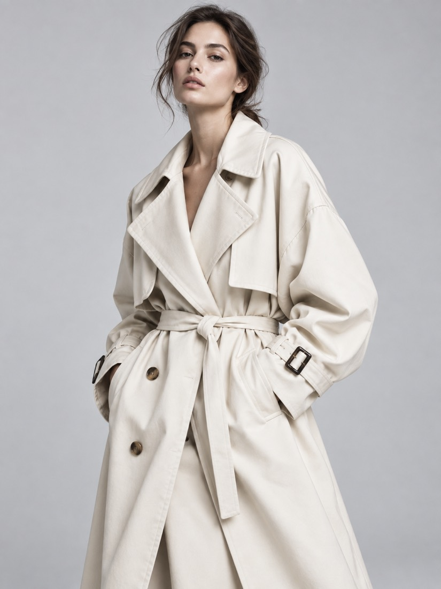
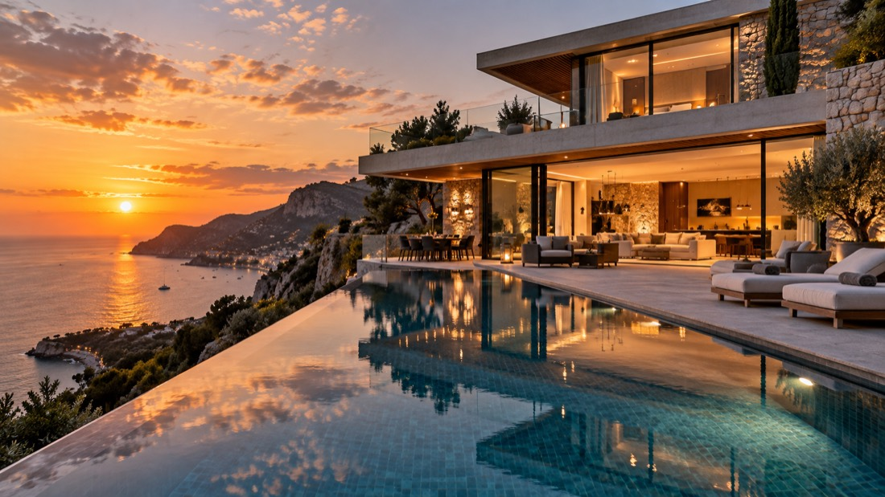
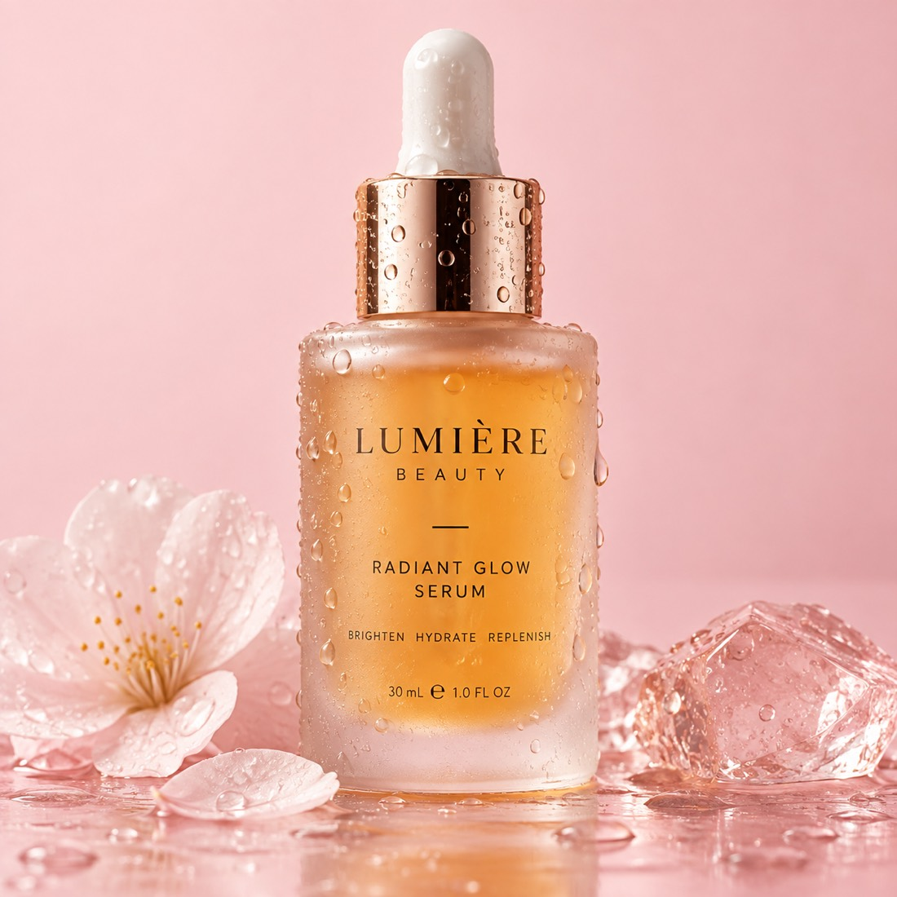
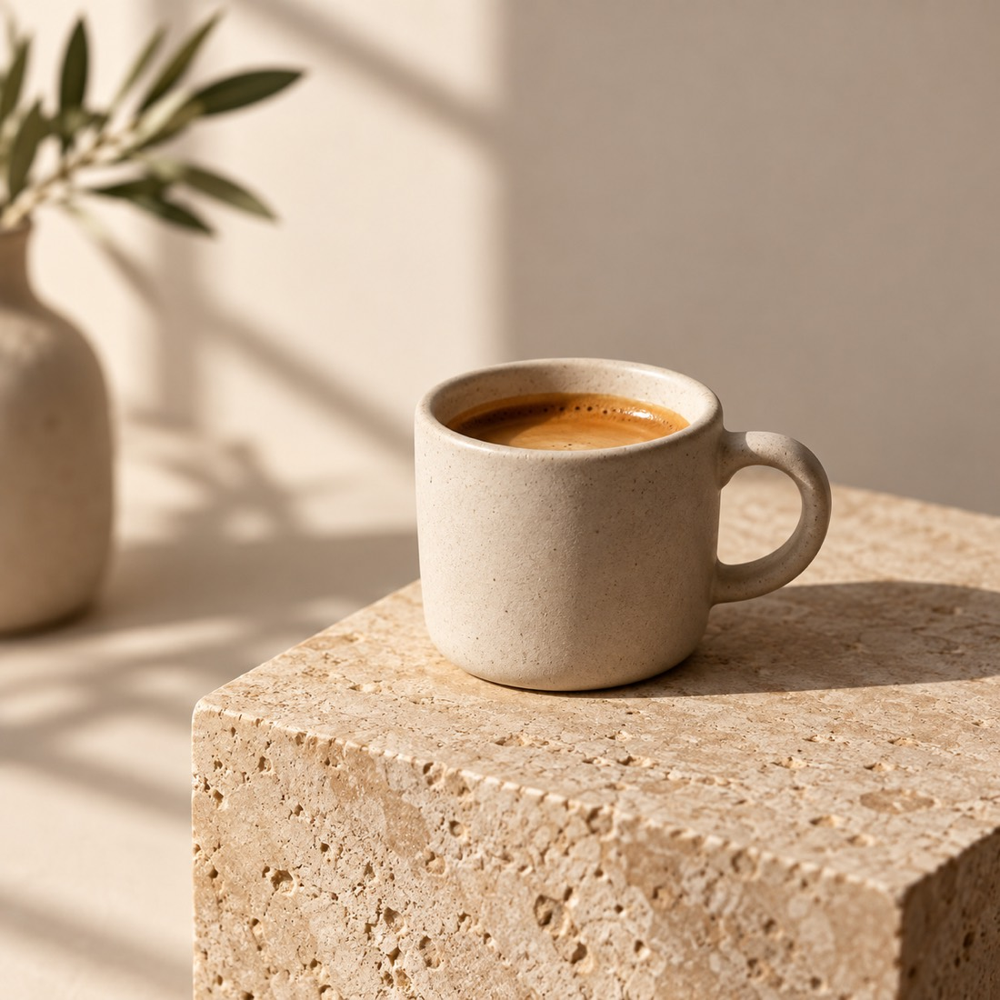

# image2.5 prompt recipes with outputs

This file is the full set of image2.5 recipes published with this repository: prompt, output, model version, aspect ratio and the cost the task reported.

Every render below was produced with `POST /v1/images/generations` on the relayed `gpt-image-2.5-ext` route at `resolution: 1K`.
Replace the prompt text, keep the structure, and reuse the ratios that fit your layout.

| Output | Recipe | Version | Ratio | Observed cost | Prompt |
| --- | --- | --- | --- | --- | --- |
|  | Cinematic night street | `flare` | 16:9 | $0.0085 | `Rain-slicked Tokyo alley at night, neon sign reflections on wet asphalt, a lone cyclist with an umbrella, cinematic 35mm film still, shallow depth of field` |
|  | Fashion editorial portrait | `flare` | 3:4 | $0.0085 | `Fashion editorial portrait of a model wearing an oversized ivory trench coat, seamless light grey studio backdrop, crisp high key lighting, medium format detail` |
|  | App icon / 3D asset | `flare` | 1:1 | $0.0085 | `Glossy 3D app icon of a paper plane folded from a coral to violet gradient material, floating on a soft neutral grey backdrop, subtle contact shadow, centered composition` |
|  | Architectural render | `flare` | 16:9 | $0.0085 | `Modern cliffside villa at golden hour, infinity pool reflecting the sky, warm interior lights, architectural photography, 24mm perspective, ultra sharp detail` |
|  | Flat vector dashboard panel | `sunburst` | 16:9 | $0.0085 | `Flat vector dashboard panel with three gauge dials, abstract latency curves and clean geometric cards, muted blue and sand palette, generous white space, crisp vector edges` |
|  | Isometric 3D cutaway | `sunburst` | 1:1 | $0.0085 | `Isometric cutaway of a compact smart home control room, tiny mid century furniture, pastel palette, clay render finish, clean soft shadows, 3D illustration` |
|  | Layered paper-cut illustration | `sunburst` | 4:3 | $0.0085 | `Layered paper cut illustration of a mountain lake sunrise, five depth layers, soft pastel palette, subtle drop shadows, art print composition` |
|  | Cosmetics packshot | `sunburst` | 1:1 | $0.0085 | `Cosmetics packshot of a frosted glass bottle with amber serum, water droplets on the surface, seamless pale pink backdrop, high detail commercial product photography` |
|  | Studio product hero | `flare` | 1:1 | $0.0085 | `Studio product hero of a matte ceramic espresso cup on a warm stone pedestal, soft window light, 85mm lens look, minimal beige backdrop, crisp shadow` |
|  | Game key art | `sunburst` | 16:9 | $0.0085 | `Fantasy game key art, an armored knight standing on a floating stone ruin above a sea of clouds, dramatic backlight, painterly detail, wide cinematic composition` |
|  | Menu food photography | `flare` | 4:3 | $0.0085 | `Overhead flat lay of a spicy ramen bowl with a soft boiled egg, chopsticks resting on the rim, dark slate table, natural side light, editorial food photography` |
|  | Macro nature detail | `sunburst` | 3:2 | $0.0085 | `Macro photograph of a dew covered monarch butterfly wing, iridescent orange scales, deep black background, focus stacked detail, studio lighting` |

## Reusing a recipe

```bash
python examples/python_generate.py --prompt "<paste a prompt above>" --version flare --size 1:1 --resolution 1K
```

Attribution: [Open image2.5 on APIMart](https://go.apimart.ai/k-6479cd) · [Pricing](https://go.apimart.ai/k-07e826) · [Get an API key](https://go.apimart.ai/k-c6f7b6)
